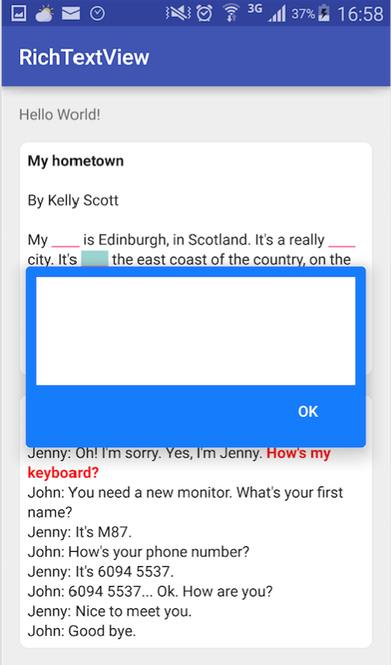
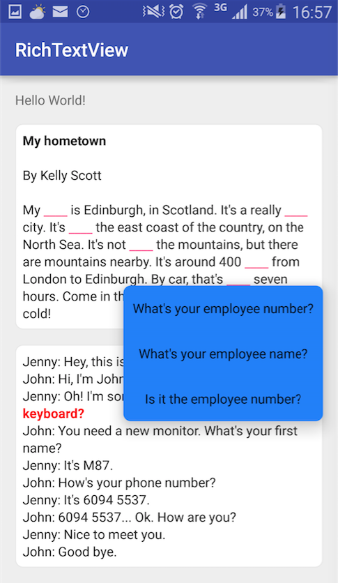

# RichTextView

##Import to your project
###Gradle
```groovy
dependencies {
    compile 'com.rayworks.library:richtextview:1.0.1'
}
```

## Snapshots



##Instructions
'GapFillTextView' can be treated as normal text view, besides that, it provides 2 ways to fill the 
gaps marked by '{*}'.

##Note
Besides the stand html text string, you also can use predefined combined symbols as a shortcut in 
the raw string which will be consumed by the widget.

bold : \*\*bold\*\* or \_\_bold\_\_

highlight: \*\*\*highlighted\*\*\* or \_\_\_highlighted\_\_\_

italic: \*italic\* or \_italic\_
 
### License
```
Copyright 2016 rayworks

Licensed under the Apache License, Version 2.0 (the "License");
you may not use this file except in compliance with the License.
You may obtain a copy of the License at

   http://www.apache.org/licenses/LICENSE-2.0

Unless required by applicable law or agreed to in writing, software
distributed under the License is distributed on an "AS IS" BASIS,
WITHOUT WARRANTIES OR CONDITIONS OF ANY KIND, either express or implied.
See the License for the specific language governing permissions and
limitations under the License.
```